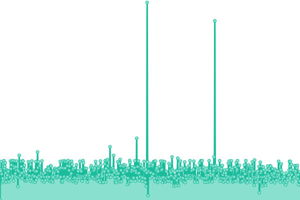
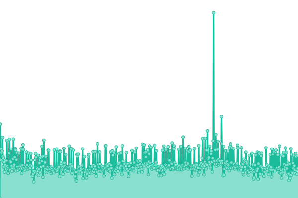
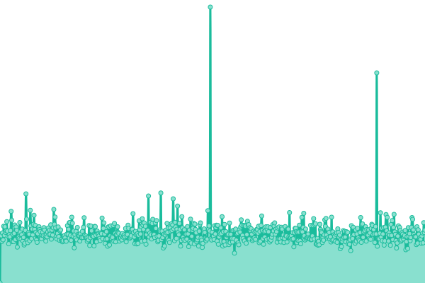
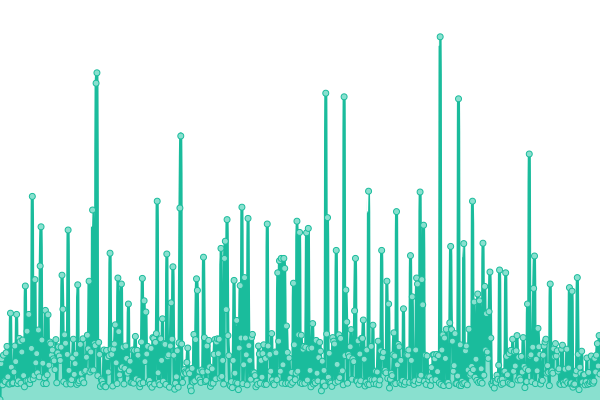
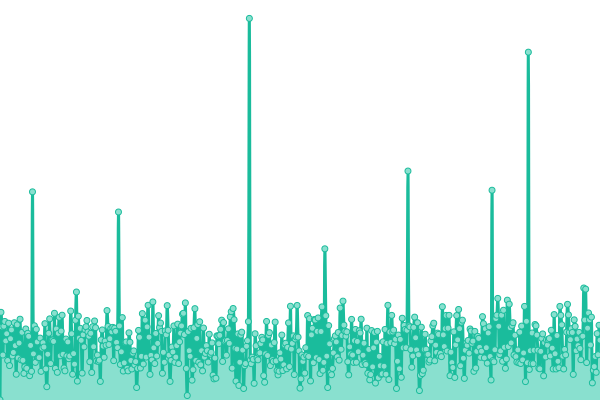
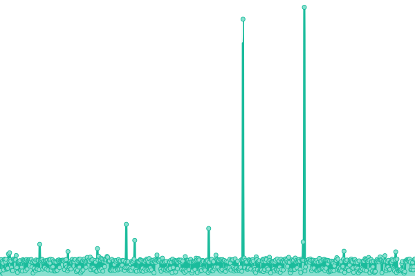
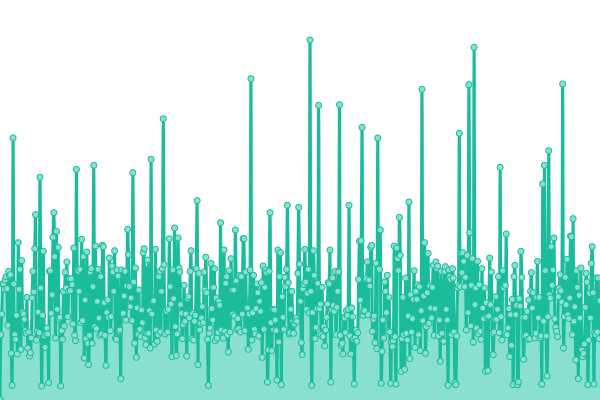

# [📈 Live Status](https://StopmotionSimonYT.github.io/website-uptime): <!--live status--> **🟩 All systems operational**

This repository contains the open-source uptime monitor and status page for [Simon](https://simonrijntjes.nl), powered by [Upptime](https://github.com/upptime/upptime).

With [Upptime](https://upptime.js.org), you can get your own unlimited and free uptime monitor and status page, powered entirely by a GitHub repository. We use [Issues](https://github.com/StopmotionSimonYT/website-uptime/issues) as incident reports, [Actions](https://github.com/StopmotionSimonYT/website-uptime/actions) as uptime monitors, and [Pages](https://StopmotionSimonYT.github.io/website-uptime) for the status page.

<!--start: status pages-->
<!-- This summary is generated by Upptime (https://github.com/upptime/upptime) -->
<!-- Do not edit this manually, your changes will be overwritten -->
<!-- prettier-ignore -->
| URL | Status | History | Response Time | Uptime |
| --- | ------ | ------- | ------------- | ------ |
|  [My Website](https://simonrijntjes.nl/) | 🟩 Up | [my-website.yml](https://github.com/OpenSourceSimon/upptime/commits/HEAD/history/my-website.yml) | 

 519ms
     
 | 

<a href="https://OpenSourceSimon.github.io/upptime/history/my-website">100.00%</a>
    

|  [My WordPress](https://simonrijntjes.nl/wordpress/) | 🟩 Up | [my-word-press.yml](https://github.com/OpenSourceSimon/upptime/commits/HEAD/history/my-word-press.yml) | 

 2082ms
     
 | 

<a href="https://OpenSourceSimon.github.io/upptime/history/my-word-press">100.00%</a>
    

|  Twingate | 🟩 Up | [twingate.yml](https://github.com/OpenSourceSimon/upptime/commits/HEAD/history/twingate.yml) | 

 563ms
     
 | 

<a href="https://OpenSourceSimon.github.io/upptime/history/twingate">98.17%</a>
    

|  Synology QuickConnect | 🟩 Up | [synology-quick-connect.yml](https://github.com/OpenSourceSimon/upptime/commits/HEAD/history/synology-quick-connect.yml) | 

 149ms
     
 | 

<a href="https://OpenSourceSimon.github.io/upptime/history/synology-quick-connect">100.00%</a>
    

|  [Unsplash API](https://source.unsplash.com/random/3840x2160/?nature) | 🟩 Up | [unsplash-api.yml](https://github.com/OpenSourceSimon/upptime/commits/HEAD/history/unsplash-api.yml) | 

 392ms
     
 | 

<a href="https://OpenSourceSimon.github.io/upptime/history/unsplash-api">99.87%</a>
    

|  [Quotable API](https://api.quotable.io/random) | 🟩 Up | [quotable-api.yml](https://github.com/OpenSourceSimon/upptime/commits/HEAD/history/quotable-api.yml) | 

 204ms
     
 | 

<a href="https://OpenSourceSimon.github.io/upptime/history/quotable-api">100.00%</a>
    

|  [Reddit Bot Documentation](https://reddit-video-maker-bot.netlify.app/) | 🟩 Up | [reddit-bot-documentation.yml](https://github.com/OpenSourceSimon/upptime/commits/HEAD/history/reddit-bot-documentation.yml) | 

 216ms
     
 | 

<a href="https://OpenSourceSimon.github.io/upptime/history/reddit-bot-documentation">100.00%</a>
    

<!--end: status pages-->

[**Visit our status website →**](https://OpenSourceSimon.github.io/website-uptime)

## 📄 License

- Powered by: [Upptime](https://github.com/upptime/upptime)
- Code: [MIT](./LICENSE) © [Simon](https://simonrijntjes.nl)
- Data in the `./history` directory: [Open Database License](https://opendatacommons.org/licenses/odbl/1-0/)
